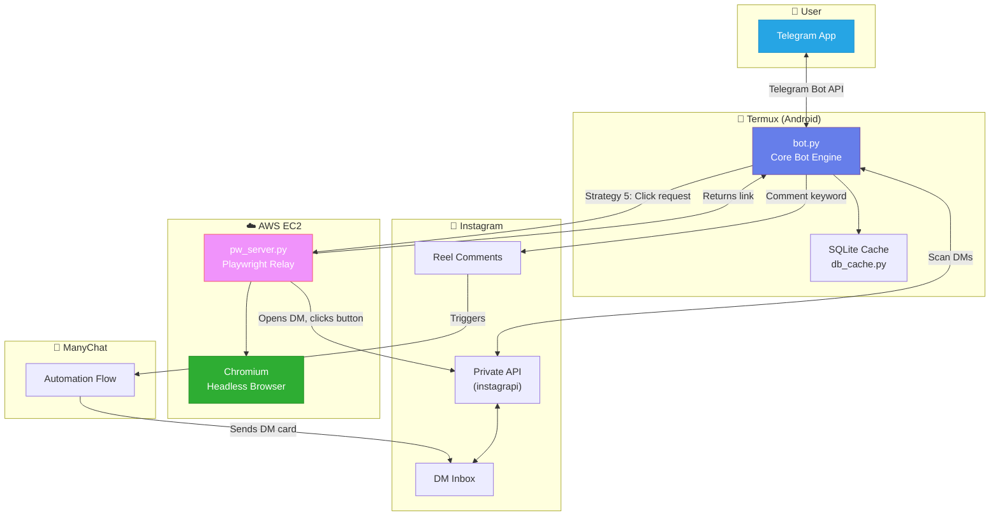

<p align="center">
  
</p>

<h1 align="center">GiveMyLink</h1>

<p align="center">
  <strong>An intelligent Instagram-to-Telegram link extraction bot with distributed browser automation</strong>
</p>

<p align="center">
  
  
  
  
  
</p>

---

## 📖 Overview

**GiveMyLink** solves a common pain point for Instagram users: extracting hidden resource links from reels. Many creators gate their resources behind ManyChat/SuperProfile automations — users must comment a keyword, receive a DM, and tap a button to get the actual link. This process is tedious and doesn't work across devices.

GiveMyLink automates the entire flow:

1. **User sends a reel URL** to the Telegram bot
2. **Bot comments on the reel** to trigger the creator's ManyChat automation
3. **Bot monitors Instagram DMs** for the automated response
4. **Bot clicks the CTA button** (using multi-strategy postback triggers or browser automation)
5. **Bot extracts and delivers the link** back to the user on Telegram — instantly

---

## 🏗️ Architecture



---

## ⚡ Key Features

### Multi-Strategy Button Interaction Engine
The bot uses a **5-layer escalation strategy** to click ManyChat postback buttons:

| Priority | Strategy | Method | Reliability |
|:---:|---|---|:---:|
| 1 | **Postback API** | Instagram's private `payload/` endpoint with auth tokens | ~30% |
| 2 | **XMA CTA Action** | Alternative `broadcast/xma_cta_action/` endpoint | ~20% |
| 3 | **Keyword Reply** | Send button text as a direct reply to the XMA card | ~50% |
| 4 | **Smart Keywords** | Extract trigger words from card title (quotes, ALL CAPS) | ~40% |
| 5 | **🚀 Playwright Relay** | Real Chromium browser on EC2 clicks the actual button | **~95%** |

### Distributed Architecture
- **Core bot** runs on Termux (Android) for 24/7 mobile operation
- **Browser relay** runs on AWS EC2 for heavyweight browser automation
- Communication via REST API with API key authentication

### Human-Like Behavior Simulation
- Randomized delays between actions (1-10s, Gaussian distribution)
- Typing indicators before sending messages
- Mark-as-seen signals before interacting
- Thread-aware rate limiting

### Multi-Account Session Management
- Concurrent operation across multiple Instagram accounts
- Automatic session rotation and load balancing
- Dead session detection and retirement
- Session persistence via base64-encoded settings

### Intelligent Caching (SQLite)
- Caches API responses to reduce redundant calls
- Thread-level deduplication
- Configurable TTL per cache category

---

## 🛠️ Tech Stack

| Component | Technology | Purpose |
|---|---|---|
| **Core Runtime** | Python 3.10+ / asyncio | Async event loop with thread pool for blocking calls |
| **Instagram API** | [instagrapi](https://github.com/subzeroid/instagrapi) | Instagram Private API client |
| **Telegram API** | [python-telegram-bot](https://python-telegram-bot.org/) | Telegram Bot interface |
| **Browser Automation** | [Playwright](https://playwright.dev/) + [playwright-stealth](https://pypi.org/project/playwright-stealth/) | Headless Chromium for button clicks |
| **Database** | SQLite3 | Local caching and state management |
| **Relay Server** | Flask | Lightweight HTTP server for Playwright requests |
| **Deployment** | Termux (Android) + AWS EC2 | Distributed mobile + cloud setup |
| **Process Management** | systemd + nohup | Service management and auto-restart |

---

## 📂 Project Structure

```
givemylink/
├── bot.py              # Core bot engine (2000+ lines)
│                       #   - Telegram command handlers
│                       #   - Instagram DM scanning & parsing
│                       #   - Multi-strategy postback trigger
│                       #   - Session management & rotation
│                       #   - Human-like behavior simulation
│
├── pw_engine.py        # Playwright browser automation engine
│                       #   - Cookie injection from instagrapi sessions
│                       #   - Stealth-mode Chromium with anti-detection
│                       #   - DOM-based CTA button detection & clicking
│                       #   - External URL interception
│
├── pw_server.py        # Flask relay server (runs on EC2)
│                       #   - REST API for button click requests
│                       #   - API key authentication
│                       #   - Async Playwright execution
│
├── db_cache.py         # SQLite caching layer
│                       #   - API response caching
│                       #   - Configurable TTL
│
├── ec2_setup.sh        # One-time EC2 provisioning script
├── ec2_deploy.py       # Automated deployment to EC2
├── ssh_sync.py         # Sync bot code to Termux via SSH
├── ssh_restart.py      # Remote bot restart via SSH
│
├── .env.example        # Environment variable template
├── requirements.txt    # Python dependencies
└── docs/
    └── banner.png      # Project banner
```

---

## 🚀 Getting Started

### Prerequisites
- Python 3.10+
- Instagram account(s) with active sessions
- Telegram Bot Token (from [@BotFather](https://t.me/BotFather))
- *(Optional)* AWS EC2 instance for Playwright relay

### 1. Clone & Install
```bash
git clone https://github.com/yourusername/givemylink.git
cd givemylink
pip install -r requirements.txt
```

### 2. Configure
```bash
cp .env.example .env
# Edit .env with your credentials
```

### 3. Generate Instagram Sessions
```bash
python get_session.py
# Follow prompts to log in and generate session IDs
```

### 4. Run the Bot
```bash
python bot.py
```

### 5. *(Optional)* Deploy Playwright Relay to EC2
```bash
python ec2_deploy.py <YOUR_EC2_IP>
# Add PW_RELAY_URL=http://<IP>:5123 to .env
```

---

## 💬 Usage

1. Open the Telegram bot
2. Send an Instagram reel URL:
   ```
   https://www.instagram.com/reel/ABC123xyz/
   ```
3. The bot will:
   - Comment on the reel to trigger the automation
   - Monitor DMs for the response
   - Extract and send you the link

---

## 🔒 Security Considerations

- All credentials stored in `.env` (never committed to git)
- EC2 relay secured with API key authentication
- Instagram sessions encrypted as base64 blobs
- SSH connections use key-based authentication

---

## 🧪 Development

### Remote Diagnostics
```bash
python check_bot.py        # Check if bot is running
python ssh_status.py       # Get detailed remote status
python ssh_restart.py      # Restart bot remotely
```

### Debug Mode
Set `DEBUG_IG=1` in `.env` for verbose Instagram API logging.

---

## 📊 System Requirements

| Environment | Minimum | Recommended |
|---|---|---|
| **Termux (Bot)** | Android 10+, 2GB RAM | Android 12+, 4GB RAM |
| **EC2 (Relay)** | t2.micro (1 vCPU, 1GB) | t3.small (2 vCPU, 2GB) |
| **Network** | Stable WiFi | Dedicated connection |

---

## 📜 License

This project is for **educational and research purposes only**. Use responsibly and in accordance with Instagram's Terms of Service.

---

<p align="center">
  Built with ☕ and determination
</p>
